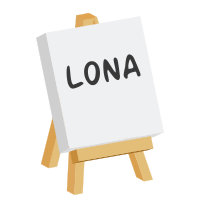

.. image:: https://img.shields.io/pypi/l/lona.svg
    :alt: pypi.org
    :target: https://pypi.org/project/lona
.. image:: https://img.shields.io/pypi/pyversions/lona.svg
    :alt: pypi.org
    :target: https://pypi.org/project/lona
.. image:: https://img.shields.io/pypi/v/lona.svg
    :alt: pypi.org
    :target: https://pypi.org/project/lona
.. image:: https://img.shields.io/codecov/c/github/lona-web-org/lona.svg
    :alt: codecov.io
    :target: https://codecov.io/gh/lona-web-org/lona/

Lona is a web application framework, designed to write responsive web apps in
**full** Python.

**Documentation:** `lona-web.org <http://lona-web.org>`_

**Changelog:** `lona-web.org/changelog <http://lona-web.org/changelog.html>`_

**Reddit:** `reddit.com/r/lona_web_org/ <https://www.reddit.com/r/lona_web_org/>`_

Web is a solved problem in Python since ages, but traditionally Python handles
only the server side. If you want to have client side interaction like
click events or you want update content live, you have to write an additional
Javascript application.

Lona handles the server side and the client side, and provides a simple,
pythonic API to write self contained views.

.. code-block:: text

    # pip install lona

.. code-block:: python

    from lona.html import HTML, Button, Div, H1
    from lona import LonaApp, LonaView

    app = LonaApp(__file__)

    @app.route('/')
    class MyView(LonaView):
        def handle_request(self, request):
            message = Div('Button not clicked')
            button = Button('Click me!')

            html = HTML(
                H1('Click the button!'),
                message,
                button,
            )

            self.show(html)

            # this call blocks until the button was clicked
            input_event = self.await_click(button)

            if input_event.node == button:
                message.set_text('Button clicked')

            return html

    app.run(port=8080)

**More information:**
`Getting Started <http://lona-web.org/end-user-documentation/getting-started.html>`_

How does it work?
-----------------

Lona comes with a Javascript based browser library that speaks a specialized
protocol with the backend.
This protocol specifies messages like "hey frontend, please show $HTML" and
"hey backend, someone clicked on node XY".

**More information:**
`Basic Concept <https://lona-web.org/basic-concept.html>`_
