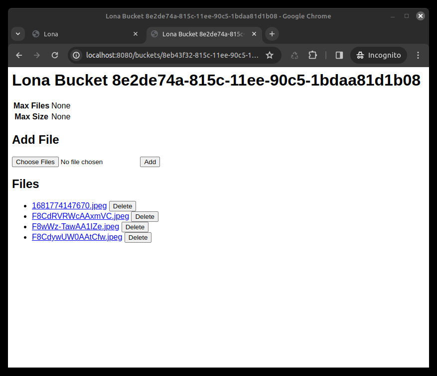

is_template: False

Buckets
=======

The bucket API implements the server-side of file-uploads and can be used to
make files accessible over HTTP. It does not implement the browser-side, so it
is best used with a library like
`lona-dropzone </demos/file-upload/index.html>`_.

A bucket is basically a temporary directory, that gets created when a bucket
is initialized with a request object, and closed automatically when the view,
associated with the request, gets removed from the server.

Usage
-----

.. code-block:: python

    from lona import View, Bucket, HTML, A

    class BucketView(View):
        def handle_request(self, request):
            self.bucket = Bucket(
                request=request,
                on_add=self.on_add,        # optional
                on_delete=self.on_delete,  # optional
            )

            return HTML(
                A(
                    'Bucket'
                    href=self.bucket.get_url(),  # link to the bucket
                    target='_blank',             # open link in new tab
                    interactive=False,           
                ),
            )

    def on_add(self, file_names):
        # this method gets called whenever a file gets added (uploaded)
        # `file_names` is a list of strings

        pass

    def on_delete(self, file_names):
        # this method gets called whenever a file gets deleted
        # `file_names` is a list of strings

        pass

Regardless of the URL of the view that opened the bucket, all buckets are
accessible at ``/buckets/<request_id>/<bucket_id>``.

To upload a file, issue a multipart POST request to
``/buckets/<request_id>/<bucket_id>/add``.

To delete a file, issue a POST form request to
``/buckets/<request_id>/<bucket_id>/delete``. The bucket will search for the
form key ``name``.

The URL prefix (``/buckets/``) can be changed using
``settings.BUCKETS_URL_PREFIX``.

When ``Bucket.index`` is enabled, a generic frontend for listing, adding, and
deleting files for a bucket is available at
``/buckets/<request_id>/<bucket_id>``.

Arguments
---------

.. api-doc:: lona.Bucket.__init__

Methods
-------

.. api-doc:: lona.Bucket.get_path
.. api-doc:: lona.Bucket.get_file_names
.. api-doc:: lona.Bucket.get_size
.. api-doc:: lona.Bucket.get_url
.. api-doc:: lona.Bucket.get_add_url
.. api-doc:: lona.Bucket.get_delete_url

Customization
-------------

The Bucket index page can be customized by overriding the template
``lona/bucket.html``.

.. code-block:: html
    :include: ../../../lona/templates/lona/bucket.html
