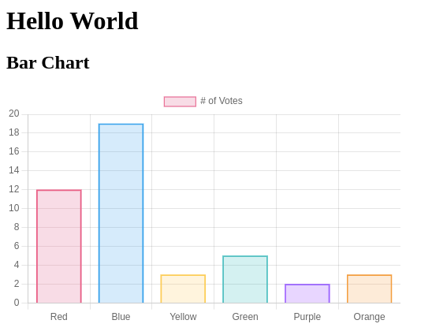

toctree: False

lona-chartjs
============

Support for `Chart.js <https://www.chartjs.org/>`_ is implemented in
in `https://github.com/lona-web-org/lona-chartjs <https://github.com/lona-web-org/lona-chartjs>`_.

Installation
------------

.. code-block:: text

    $ pip install lona-chartjs

Usage
-----

``lona_chartjs.Chart`` defines a thin wrapper around the Javascript API of
Chart.js. You can take any demo off
``chartjs.org <https://www.chartjs.org/docs/3.5.0/>`` and pass the chart config
into ``Chart.data``.

All data you passed in is available in ``Chart.data`` and can be reset and
altered. To redraw the chart with altered data run ``self.show(chart)`` from
your view.

.. code-block:: python

    from lona import LonaApp, LonaView
    from lona.html import HTML, H1, H2
    from lona_chartjs import Chart

    app = LonaApp(__file__)

    BAR_CHART_DATA = {
        # Taken from https://www.chartjs.org/docs/latest/getting-started/usage.html

        'type': 'bar',
        'data': {
            'labels': ['Red', 'Blue', 'Yellow', 'Green', 'Purple', 'Orange'],
            'datasets': [{
                'label': '# of Votes',
                'data': [12, 19, 3, 5, 2, 3],
                'backgroundColor': [
                    'rgba(255, 99, 132, 0.2)',
                    'rgba(54, 162, 235, 0.2)',
                    'rgba(255, 206, 86, 0.2)',
                    'rgba(75, 192, 192, 0.2)',
                    'rgba(153, 102, 255, 0.2)',
                    'rgba(255, 159, 64, 0.2)'
                ],
                'borderColor': [
                    'rgba(255, 99, 132, 1)',
                    'rgba(54, 162, 235, 1)',
                    'rgba(255, 206, 86, 1)',
                    'rgba(75, 192, 192, 1)',
                    'rgba(153, 102, 255, 1)',
                    'rgba(255, 159, 64, 1)'
                ],
                'borderWidth': 1
            }]
        },
        'options': {
            'responsive': False,
            'scales': {
                'y': {
                    'beginAtZero': True,
                }
            }
        }
    }

    @app.route('/')
    class MyLonaView(LonaView):
        def handle_request(self, request):
            html = HTML(
                H1('Hello World'),
                H2('Bar Chart'),
                Chart(
                    width='500px',
                    height='300px',
                    data=BAR_CHART_DATA,
                ),
            )

            self.show(html)

    if __name__ == '__main__':
        app.run()
