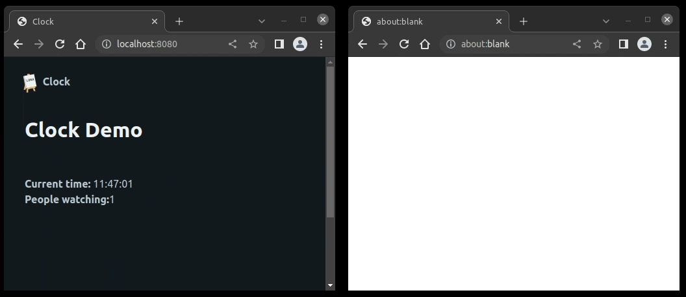

Channels
========

This demo showcases the :link:`channels API </api-reference/channels.rst>` by
implementing a global clock, using a
:link:`middleware </api-reference/middlewares.rst>` which also holds a counter,
how many users are currently viewing the clock.

Install Dependencies
--------------------

.. code-block:: text

    pip install lona lona-picocss

Source code
-----------

.. code-block:: python
    :include: demo.py
