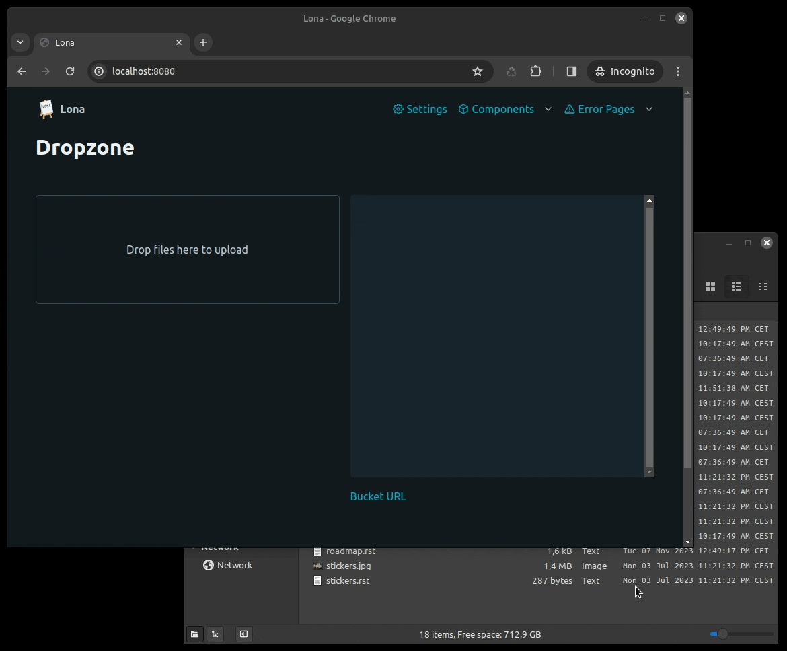

File Upload
===========

This demo showcases a file-uploads, using
:link:`lona-dropzone <https://github.com/lona-web-org/lona-dropzone>`, which
uses the :link:`bucket API </api-reference/buckets.rst>` internally.

Install Dependencies
--------------------

.. code-block:: text

    pip install lona lona-picocss

Source code
-----------

.. code-block:: python
    :include: demo.py
