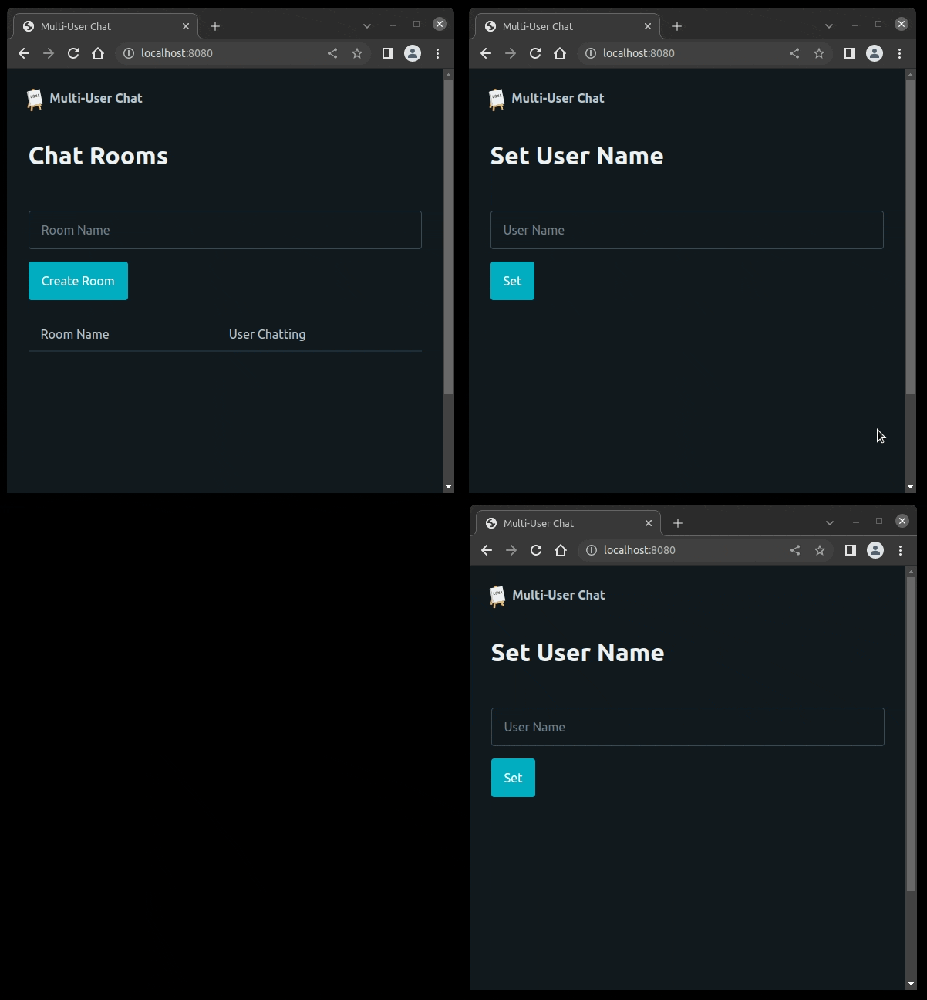

Multi User Chat
===============

This demo showcases a multi-user chat application using
:link:`channels </api-reference/channels.rst>`,
:link:`server state </cookbook/using-server-state.rst>`, and
:link:`sessions </api-reference/sessions.rst>`.

Each user can choose a username, which is then associated with their session
and persists across browser reloads. Users can also create chat rooms and join
existing ones. The landing page of the demo displays a list of previously
created chat rooms, as well as the number of users currently engaged in
conversation.

Install Dependencies
--------------------

.. code-block:: text

    pip install lona lona-picocss

Source code
-----------

.. code-block:: python
    :include: demo.py
