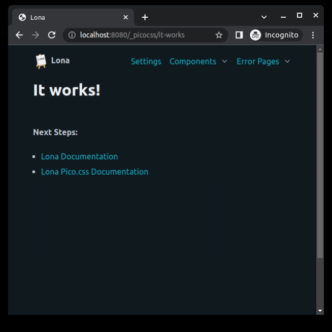
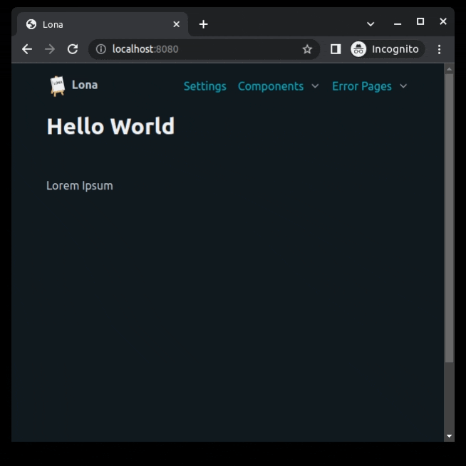
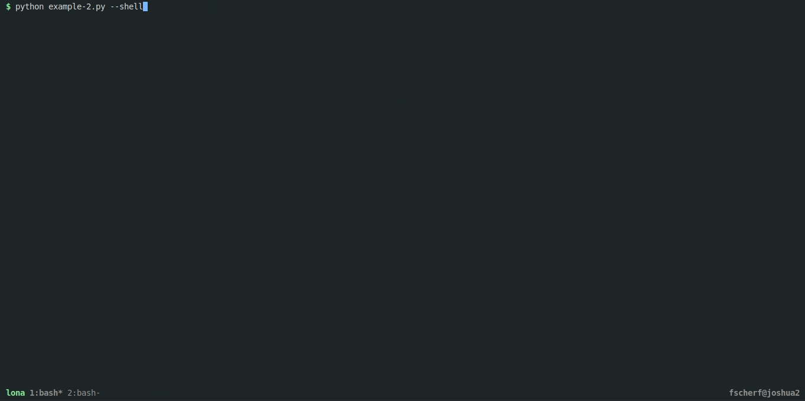

1. Getting Started
==================

Introduction
------------

Lona is a full-stack web-application framework. That means it is possible to
write a whole, self-contained, web application in pure Python. Lona runs
completely on the server. Traditionally that would mean that Lona could only do
"backend" tasks, like talking to a database, but no "frontend" tasks like
responding to a click event in the browser. Lona implements a generic frontend
that can be controlled by the backend, live, over websockets.

**More information:**
 - `Frontend and Backend (Wikipedia) <https://en.wikipedia.org/wiki/Frontend_and_backend#Back-end_focused>`_

Apps, Projects and Scripts
--------------------------

In this tutorial we will create and discuss multiple Lona "apps" (short for
"application"). A Lona app consists of one or more "views", which are Python
classes, that render one page of a website, created with Lona. Every example in
this tutorial is its own app.

Lona apps can be structured as
`projects <https://github.com/lona-web-org/lona-project-template>`_ and as
{{ link('/api-reference/lona-scripts.rst', 'scripts') }}. The main difference
is that Lona projects contain multiple files, and scripts can define a whole
Lona app, using only one file. Both structures have the same features, and can
easily be migrated from one to another.

In this tutorial we will focus on scripts, because they are easier to setup,
and the examples are easier to copy-paste.

Lona comes with a very bland (or lack of) styling. We will use
`lona-picocss <https://github.com/lona-web-org/lona-picocss#readme>`_  in this
tutorial, so our apps will look nice from the start.

Prerequisites
-------------

Lona requires at least Python 3.7, and is built on top of aiohttp and Jinja2,
so you need to be able to run pip on your system.
The web application server should be compatible with any system that can run
Python, but some debug features, like the debug shell, might have some
problems on non-unix systems.

Installation
------------

Lona is packaged, and distributed on `pypi <https://pypi.org/>`_. Use
`pip <https://pip.pypa.io/en/stable>`_ to install Lona.

.. code-block::

    pip install lona lona-picocss

If you want to use Lona locally in a project directory, and don't want to
install Lona globally, use a
`virtualenv <https://docs.python.org/3/library/venv.html>`_.

.. code-block::

    python3 -m venv env
    source env/bin/activate

These two commands set you up with a virtualenv, and then "source" it, so
the virtualenv will be used in the current shell. You will have to repeat the
second step when you close and reopen your shell.

Run Lona
--------

Put this example into a new Python file.

.. code-block:: python
    :include: example-1.py

The script creates an app, using the ``lona.App`` class, using ``__file__`` as
the **project root** (``__file__`` is a Python internal variable, that points
to the current file).

Every Lona script and project has a **project root**. Every path within the
app, like template paths, static directories or routes, will be relative to
this directory.

The last line of the script (``app.run()``), will run the application server,
and block until ``CTRL-C`` was hit. 
Run the script using:

.. code-block::

    python example.py

``app.run()`` takes keywords like ``host`` or ``port`` for configuration, and
also parses the command line. Run ``python example.py -h`` to print the help.
If port 8080 is taken by another application, you can set environment
variable ``LONA_DEFAULT_PORT`` to some other port, affecting all examples that 
do not set the port explicitly.

When ``live_reload`` is set to ``True`` Lona will watch the scripts project
root and restart the server when a file in it gets written.

The script should print that it opened a webserver on
``http://localhost:8080``. If you navigate your browser there, you should see
this:

Hello World
-----------

The previous example had no actual view in it. Extend your script like this
to create a simple hello world.

.. code-block:: python
    :include: example-2.py

Restart your script using ``CTRL-C`` and navigate to ``http://localhost:8080``.
This second example will be our template for the rest of the tutorial.

The Server Reference
--------------------

In Lona, the {{ link('/api-reference/server.rst', 'server') }} reference is the
central place where all settings and runtime state lives. It is available in
every view using ``self.server``, in every middleware and in the shell.

Settings
--------

Lona is highly configurable and most of its inner workings can be configured
using settings. In Lona projects, settings are set in one or more dedicated
``settings.py`` files. In scripts, settings can be set via the
``app.settings`` property.

A full list of all default settings can be found here:
{{ link('/api-reference/settings.rst', 'Settings') }}.

It is highly encouraged to define custom settings for your specific use-case,
or for Lona extensions, as long as their names do not clash with the default
settings.

.. code-block:: python
    :include: example-3.py

Import Strings
--------------

If you use Lona in a
`project <https://github.com/lona-web-org/lona-project-template>`_, views,
settings, and routes are placed in different files. In other frameworks, these
files would have to be valid
`Python modules <https://docs.python.org/3/tutorial/modules.html>`_ to make
them loadable.

Lona implements a special form of import strings, that can load Python code
from pretty much everywhere, regardless if it can be imported using the
``import`` statement or not.

Import strings are a convenience-mechanism, which is not required. You can use
default Python imports wherever you can use import strings.

.. code-block:: python

    # Python import
    from my_app.views import IndexView

    Route('/', IndexView)

    # load from a module
    Route('/', 'my_app.views.IndexView')

    # load from a third-party-package
    Route('/settings', 'lona_picocss.views.SettingsView')

    # load from a script
    Route('/my-view', './views.py::MyView')

Debugging
---------

For debugging, Lona comes with a builtin shell, powered by
`rlpython <https://github.com/fscherf/rlpython>`_. rlpython is an REPL, so it
accepts valid Python expressions, and also custom commands using the prefix
``%``.

Lona defines a list of useful commands, for example to get a list of all
currently running views, or to print all settings, environment variables and
state. All Lona specific commands are prefixed ``%lona_`` and have a builtin
help, that can be printed using ``-h``.

The shell can be run from the same shell that the application server uses,
using ``python example.py --shell``. Hit ``CTRL-D`` to exit the shell, and stop
the server.

**More Information:** {{ link('/api-reference/lona-shell.rst', 'Lona Shell') }}

.. rst-buttons::

    .. rst-button::
        :link_title: 2. HTML
        :link_target: /tutorial/02-html/index.rst
        :position: right
