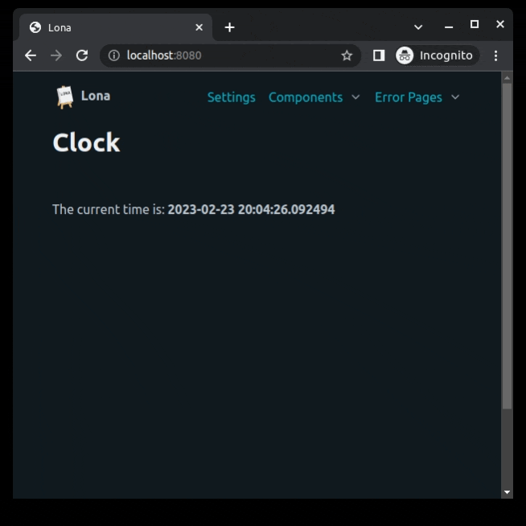
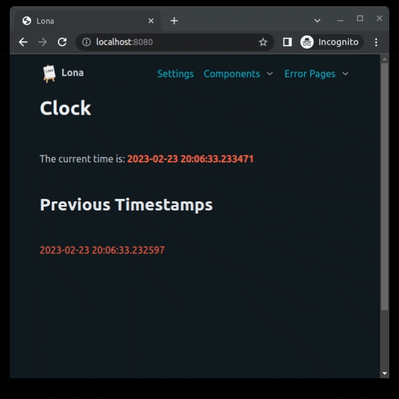

2. HTML
=======

In Lona, any HTML element can be represented using Python objects, derived from
``lona.html.Node``.

This

.. code-block:: python

    from lona.html import Div, Span

    Div(
        Span('Hello World'),
        _class='hello-world-div',
        _style={
            'color': 'red',
        },
    )

is the equivalent to this

.. code-block:: html

    

        Hello World
    

Like in traditional HTML, Lona nodes form a tree. Child nodes, like the span
in the first example, are available via ``Node.nodes``. Lona nodes have support
for element classes, ids, attributes and styling via the ``Node.class_list``,
``Node.id_list``, ``Node.attributes`` and ``Node.style`` properties.

When a node gets initialized, all arguments are treated as child nodes of the
new node and all keyword arguments are treated as element attributes, later
available in ``Node.attributes``. Special keywords like ``class``, ``id``,
``style`` or ``nodes`` will end up in their respective property counterparts.

Nodes, as well as their properties ``Node.nodes``, ``Node.id_list``, and
``Node.class_list``, behave like Python lists. They support indexing, slicing,
and common interfaces like ``append()`` or ``remove()``. ``Node.attributes``
and ``Node.style`` behave like Python dictionaries.

All strings that get passed to a node, or to ``Node.nodes``, get converted to a
``lona.html.TextNode``, which behave like strings.

Nodes Are Unique
----------------

Lona nodes are unique, and can be part of exactly one node tree at a time. If
you add a node to another node, and it was part of another node before, it gets
unmounted before. That means even if you append a node to another node multiple
times, there will never be more than one reference to the same node.

.. code-block:: python

    >>> from lona.html import Div, Span
    >>> div = Div()
    >>> span = Span()

    >>> div.append(span)
    >>> div.append(span)
    >>> div.append(span)

    >>> div
    

        
    

Showing HTML In The Browser
---------------------------

There are two ways to show HTML in the browser: Returning HTML from the
``View.handle_request()`` method or by running ``View.show()``.

Returning HTML
~~~~~~~~~~~~~~

This example returns an HTML tree, showing it once and exiting
``View.handle_request()``.

.. code-block:: python
    :include: example-1.py

View.show()
~~~~~~~~~~~

The second example runs ``View.show()`` in a loop continuously, to update the
HTML that is shown in the browser.

When ``View.show()`` gets called with the same HTML node object twice, Lona
sends only updates. If the HTML was not changed ``View.show()`` does nothing.

.. code-block:: python
    :include: example-2.py

More Complex Example
~~~~~~~~~~~~~~~~~~~~

.. code-block:: python
    :include: example-3.py

HTML Strings
------------

When initializing big HTML trees it can be more convenient to write HTML as a
string. Lona can parse any given HTML string into a Lona Node tree, that then
can be manipulated using the Lona node API. The HTML class is special in this respect.

.. code-block:: python

    >>> from lona.html import HTML

    >>> html = HTML(""""
            

                
            
        """")

    >>> html[0].id_list.append('baz')

    >>> html
    

        
    

**More information:** `Using HTML Strings </api-reference/html.html#using-html-strings>`_

Raw HTML
--------

Lona represents HTML nodes as high-level Python objects, which have an inherit
overhead, especially when handling big HTML trees as strings, that have to be
parsed before.

``lona.html.RawHTML`` takes HTML as a string, and does not convert it to a Lona
node tree on the server, but renders it as HTML on the client. The HTML string
can be updated by setting ``RawHTML.inner_html``.

.. code-block:: python

    >>> from lona.html import RawHTML

    >>> RawHTML('<h1>Hello World</h1>')
    

        <h1>Hello World</h1>
    

Selectors
---------

When handling deeply nested HTML trees, lookups can become tedious. Lona
implements ``Node.query_selector()`` and ``Node.query_selector_all()`` to find
and iterate over matching nodes.

.. code-block:: python

    >>> from lona.html import Div

    >>> div = Div(
            Div(
                Div(
                    Div(id='foo'),
                ),
            ),
        )

    >>> foo_div = div.query_selector('div#foo')

**More information:** `Selectors </api-reference/html.html#selectors>`_

Locking
-------

Lona is highly multi-threaded and ``View.show()`` gets called implicitly in
some cases, for example when handling click events. When making multiple
modifications to a HTML tree, it can become important that none of the
intermediate steps get sent to the browser. Let's say you want to open a popup:
You have to create the popup, set its header, set its body, configure its
buttons and then show it. Any state, but the last one could lead to bad
user experience.

To accomplish that, Lona nodes implement locks. All modifications, made to a
node, trigger an implicit lock, if the current thread does not hold one. This
makes sure that you do not modify a node accidentally, that is currently locked
by another thread.

.. code-block:: python

    >>> from lona_picocss.html import Modal

    >>> modal = Modal()

    >>> with modal.lock:
            modal.set_header('Hello World')
            modal.set_body('Lorem ipsum')
            modal.open()

**More information:** `Locking </api-reference/html.html#locking>`_

Extending Node Classes
----------------------

Lona HTML nodes are just simple Python classes. To extend node classes, create
custom ones, or to create high-level components, just inherit from
``lona.html.Node`` or a node class like ``lona.html.Div``.

.. code-block:: python

    >>> from lona.html import Node

    >>> class Counter(Node):
            TAG_NAME = 'div'
            CLASS_LIST = ['counter']

            def __init__(self, initial_value):
                super().__init__()

                self.nodes = [
                    str(initial_value),
                ]

            def increment(self):
                with self.lock:
                    current_value = int(self.nodes[0])
                    new_value = current_value += 1

                    self.nodes = [
                        str(new_value),
                    ]

    >>> counter = Counter(10)
    >>> counter
    
10

    >>> counter.increment()
    >>> counter
    
11

.. rst-buttons::

    .. rst-button::
        :link_title: 1. Getting Started
        :link_target: /tutorial/01-getting-started/index.rst
        :position: left

    .. rst-button::
        :link_title: 3. Events
        :link_target: /tutorial/03-events/index.rst
        :position: right
