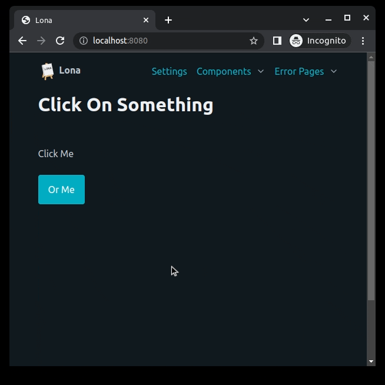
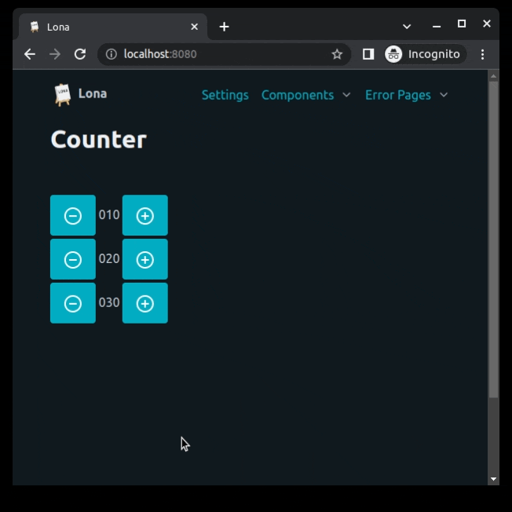
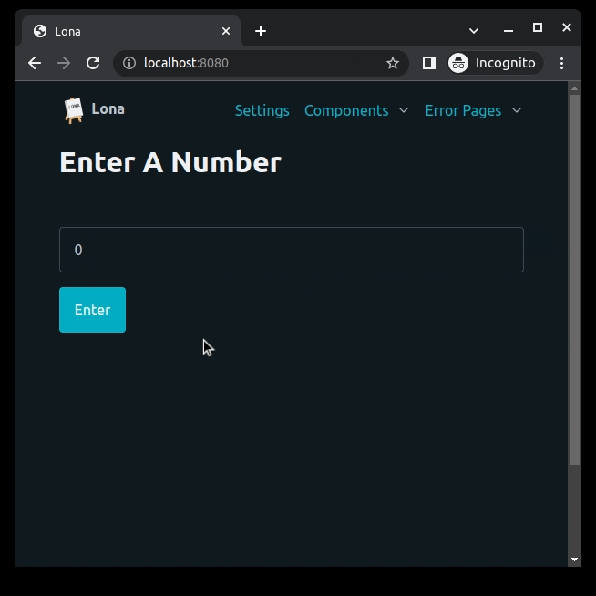

03 Events
=========

Lona nodes can produces events like click events, so views can react to button
clicks for example. To receive input events you have to tell Lona which node
should produce which event by setting ``Node.events``, which is a list of event
types. Supported events are ``lona.html.CLICK``, ``lona.html.CHANGE``,
``lona.html.FOCUS`` and ``lona.html.BLUR``.

.. note::

    The browser has to be able to fire the set event type, for your event to
    work. For example a ``div`` element can not fire a ``CHANGE`` event.

Input events get handled in a chain of hooks. Every hook is required to return
the given input event, to pass it down the chain, or return ``None`` to mark
the event as handled.

The first member of the chain is ``View.handle_input_event_root()``. If the
event got returned, Lona searches for the node instance that issued the event
and passes the event into its ``Node.handle_input_event()`` which tries
multiple node internal callbacks like ``Node.handle_click`` or
``Node.handle_change``.  As long as the event gets returned, Lona bubbles the
event up the HTML tree. If the event got returned by the outer most node in the
tree, Lona checks if ``View.handle_request()`` awaits an input event using
``View.await_[input_event|click|change]()``. If not,
``View.handle_input_event()`` gets called as last member of the chain.

Input events can, but don't have to, contain a reference to the node that
issued the event in ``input_event.node``.

Input event handler can return redirect responses, even after
``View.handle_request()`` stopped.

When a callback based input event event handler makes changes to the currently
shown HTML, Lona calls ``View.show()`` implicitly, to send the changes to the
browser.

This example shows some simple, callback based input event handlers.

.. code-block:: python
    :include: example-1.py

HTML Nodes
----------

Like mentioned before, Lona nodes can handle input events on their own, without
bothering the view and application code. That is useful to encapsulate
functionality and behavior, to make it reusable.

The Lona standard library defines nodes like ``lona.html.TextInput``, which
handle their issued ``CHANGE`` events on their own to update their inner state,
available in ``lona.html.TextInput.value``. To receive events from these nodes
set their ``bubble_up`` property to ``True``.

This example implements a simple node, that contains a counter and two buttons
to increment or decrement it. All input events get handled internally, without
the rest of the HTML or view knowing.

.. code-block:: python
    :include: example-2.py

Async API
---------

Lona events can also be awaited, instead of being handled in callbacks. This
makes for a more clear control flow, and is useful when building wizards, or
long running views that need confirmation at some point.

.. note::

    When using ``View.await_[input_event|click|change]()`` one Python thread is
    blocked, until a matching event was issued, or the view stops.

This example implements a simple wizard, that uses ``View.await_input_event()``
to await input of two numbers, to then display their sum.

.. code-block:: python
    :include: example-3.py

**More information:** `Input Events </api-reference/views.html#input-event-types>`_

.. rst-buttons::

    .. rst-button::
        :link_title: 02 HTML
        :link_target: /tutorial/02-html/index.rst
        :position: left

    .. rst-button::
        :link_title: 04 Routing
        :link_target: /tutorial/04-routing/index.rst
        :position: right
