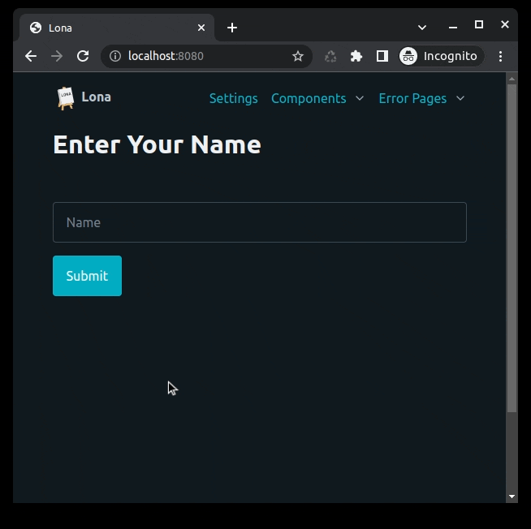

4. User Input
=============

The Lona standard library provides HTML nodes like ``lona.html.TextInput`` or
``lona.html.CheckBox`` to handle user input.

Unlike in traditional frameworks, you don't have to submit a whole form of data
to retrieve user input, because every input node from the standard library
synchronizes its value with the server automatically, using
{{ link('/tutorial/03-events/index.rst', 'events') }}. These events get
handled in the background by default, but if you want to get notified on
changes set ``bubble_up=True`` in any input node.

If a view is a
{{ link('/tutorial/07-daemon-views/index.rst', 'daemon view') }}, all input
values get synchronized across all connected browsers.

This example shows a view with an input and a button. When the button is
clicked, the value of the input gets accessed by the view. Before clicking
"Submit" the value of the input is always synchronized with the value
that is present in the browser. That means all intermediate states of a not
completed input are always sent to the server, even if "Submit" never gets
clicked.

.. code-block:: python
    :include: example-1.py

.. rst-buttons::

    .. rst-button::
        :link_title: 3. Events
        :link_target: /tutorial/03-events/index.rst
        :position: left

    .. rst-button::
        :link_title: 5. Routing
        :link_target: /tutorial/05-routing/index.rst
        :position: right
