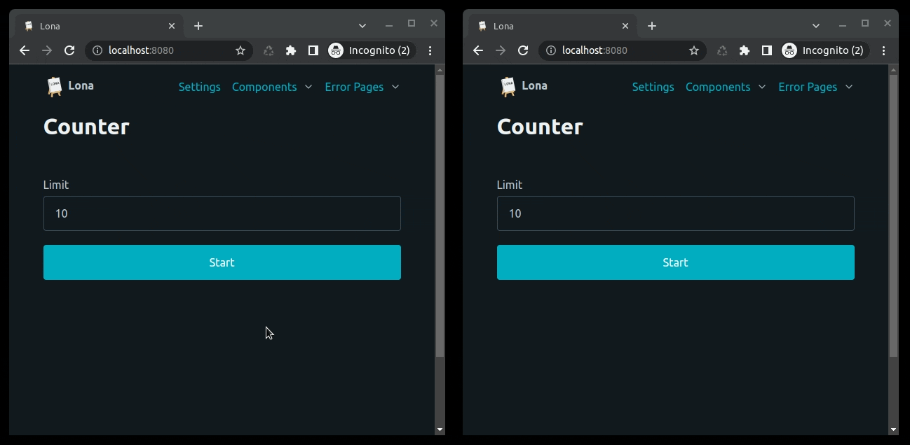

6. Daemon Views
===============

Closing the browser that displays a Lona view will result in the view getting
stopped on the server as well. When two browsers open the same URL at the same
time, two view instances get started. This emulates the behavior of most other
web frameworks.

Lona views run entirely on the server, thread-safe, and self-contained with all
state in them. When ``View.is_daemon`` is set to ``True``, a view can run in the
background and be synchronized and displayed in multiple browsers at the same
time. That also makes long running views possible, where long running tasks can
be started and later revisited.

Daemonized views are only available to the same user that started the view.

.. note::

    Daemonized views are not meant to be used to create multi-user views.
    They are meant to create single-user views that are long running and/or
    should be visible in multiple browsers at the same time.

    If you want to create multi-user views, use
    `view events </demos/multi-user-chat/index.html>`_.

Short Running View
------------------

This example implements a short running view, implementing a simple counter
and a text area. By deamonizing it, its content gets synchronized between all
browser tabs of the same user.

This style of view is called "short running" because its ``handle_request()``
method returns immediately.

.. note::

    Daemonized views get removed immediately from the server when their
    ``LonaView.handle_request()`` returns.  Since version 1.11, you can disable
    this and keep the daemonized view running by setting
    ``LonaView.STOP_DAEMON_WHEN_VIEW_FINISHES`` to ``False``.

    This behavior needs to be manually enabled due to backward compatibility,
    but will be the default from Lona 2.0 onwards.

.. image:: example-1.gif

.. code-block:: python
    :include: example-1.py

Long Running View
-----------------

This example implements a more complex counter, that counts on its own in the
background and can be canceled using a pop-up. This style of view is called
"long running" because its ``handle_request()`` method runs as long as the view
runs.

This is handy for writing wizards or processing huge amounts of data.

.. note::

    This style of view blocks one Python thread for its entire runtime.

.. code-block:: python
    :include: example-2.py

.. rst-buttons::

    .. rst-button::
        :link_title: 5. Responses
        :link_target: /tutorial/05-responses/index.rst
        :position: left

    .. rst-button::
        :link_title: 7. State
        :link_target: /tutorial/07-state/index.rst
        :position: right
