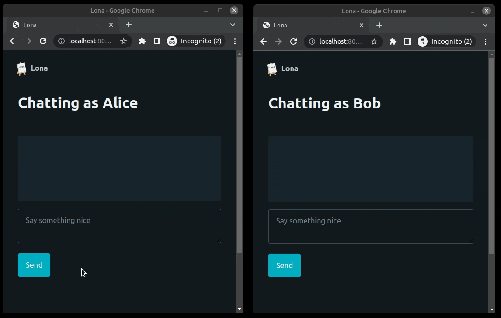

8. Channels
===========

Lona implements a simple publish/subscribe system, that follows the broker
pattern, called :link:`channels </api-reference/channels.rst>`.

Channels are a powerful tool for creating multi-user features in Lona
applications. By allowing users to communicate with each other in soft
real-time, channels can be used to create a wide range of collaborative and
interactive features, such as real-time chat, collaborative editing,
multiplayer games, and more.

.. note::

    *soft* real-time means "no timing guarantees" in this case. Messages are
    guaranteed to arrive at every subscribed channel exactly once, in the
    correct order, but not at a specific time.

This example shows a very simple multi-user chat, implemented using channels.
For a more elaborated version take a look at the
:link:`Multi User Chat </demos/multi-user-chat/index.rst>` demo.

(When trying this demo, choose a chat name via the URL
``http://localhost:8080/Alice``)

.. code-block:: python
    :include: example.py

**More information:** :link:`Channels </api-reference/channels.rst>`

.. rst-buttons::

    .. rst-button::
        :link_title: 7. Daemon Views
        :link_target: /tutorial/07-daemon-views/index.rst
        :position: left

    .. rst-button::
        :link_title: 9. State
        :link_target: /tutorial/09-state/index.rst
        :position: right
