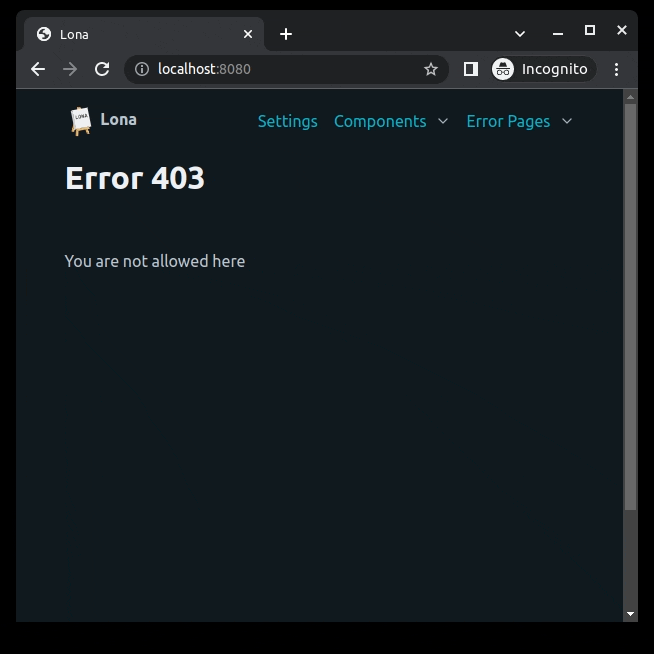

8. Middlewares
==============

Lona has support for middlewares, to implement things like authentication,
global logging or start and stop hooks.

This example implements a simple password middleware that prohibits execution
of any view, if no valid password was set in the GET variable ``p``.

.. code-block:: python
    :include: example-1.py

**More information:** `Middlewares </api-reference/middlewares.html>`_

.. rst-buttons::

    .. rst-button::
        :link_title: 7. State
        :link_target: /tutorial/07-state/index.rst
        :position: left

    .. rst-button::
        :link_title: 9. Static Files
        :link_target: /tutorial/09-static-files/index.rst
        :position: right

